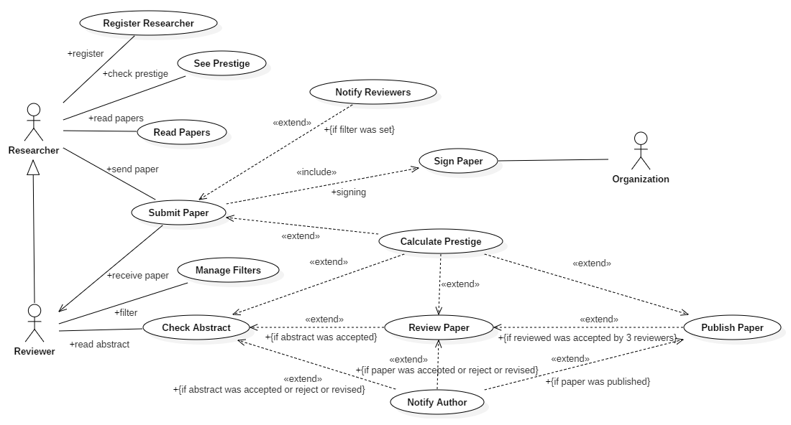

# Welcome to SMART Publish Research

SMART Publish Research (a.k.a Ethres) is an Open Source project that allows to researchers publish their research papers and finding reviewers.

## Goals
* Researchers and reviewers engage between them avoiding intermediaries.
* Researchers and reviewers obtain public prestige with their work.
* Sharing knowladge with garantees avoiding a central authority. 

## Technology
Ethres is builded using Ethereum Blockchain so the same principles are applies:
1. Transparency: Every paper and its respective value are visible to anyone with an access to system.
2. Peer-to-peer transmision: There is not a central authority. 
3. Ownership: Papers are tracked by their author.
4. Inmutability: Data is never deleted, just updated with new versions.

## Use Case: Publish Paper

## Flow: Publish Paper

## Architecture
Ehtres consist of Smart Contracts (SC) for Ethereum Blockchain that implement -Dapp logic to publish, review papers.

## Components
